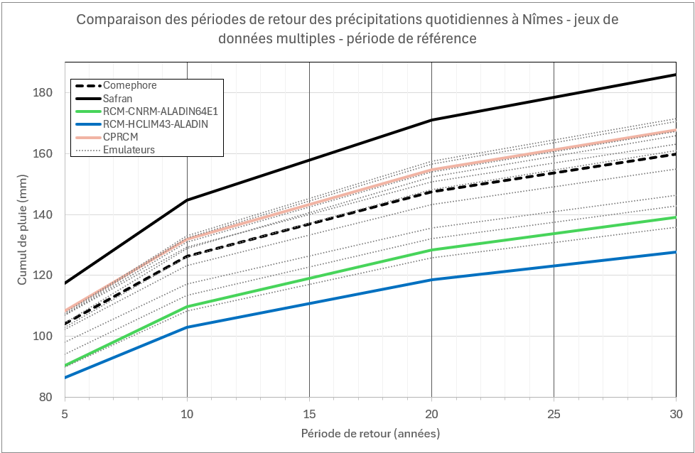
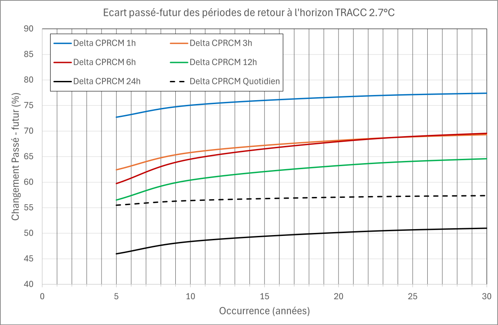
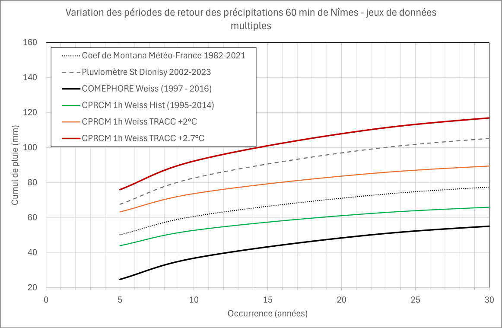
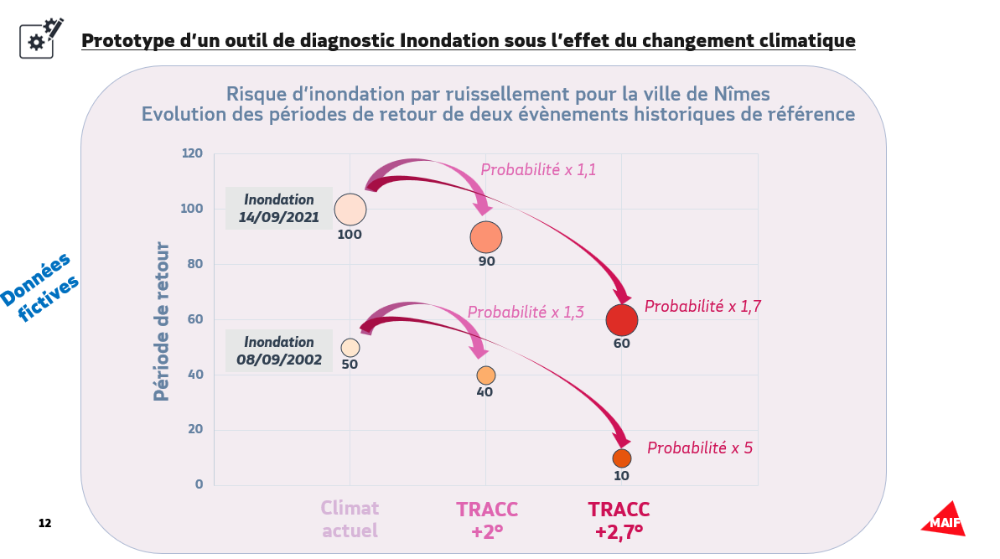

# 🚀 Période de retour vers le futur
**Projet : Analyse des pluies extrêmes et périodes de retour dans un contexte de réchauffement climatique**

---

## 📌 Contexte  
Selon **Météo-France**, *le réchauffement climatique ne bouleverse pas seulement les températures : il modifie aussi la fréquence, l’intensité et la répartition des précipitations en France.*
Dans une France à **+4 °C**, l’impact de ces changements des régimes de pluies peuvent aggraver le risque d’inondation par ruissellement en zones urbaines.

Cette *réutilisation* s’inscrit dans le cadre du **Hackathon 2025 : “Le climat en données”**.

---

## 🔍 Problématiques scientifiques  
1. **Estimations des pluies extrêmes sur la période historique ?**  
   - Analyse de l'apport des données CPRCM et comparaison de plusieurs sources de données : modélisations et réanalyses  
2. **Quel apport des données horaires pour estimer les pluies 24h par rapport au données quotidiennes ?**  
3. **Evolution des intensités de précipitations par période de retour pour l’horizon TRACC 2.7°C ?**  
   - Résultats des données CPRCM (1h/3h/6h/12h/24h/quotidien)

---

## 💼 Problématique métier  
- **Question clé :**  
  À quel type de pluies faut-il se préparer dans le futur ?  

- **Proposition de valeur :**  
  Aider et accompagner les territoires à renforcer leur résilience et assurer la pérennité du système assurantiel.

---

## ✅ Solution proposée  
### **Description et fonctionnalités**  
- Offre d’accompagnement *Territoires et Prévention* enrichie d’un diagnostic du risque de ruissellement en fonction des scénarios de réchauffement climatique.
- Offre de **formation** pour les élus et agents.  

### **Usage des données**  
- Les données permettent d’estimer les **périodes de retour** des pluies extrêmes.

- **Sources des données :** 

| **Expériment**                     | **GCM**             | **Membre**       | **Méthode descente d’échelle** | **Simulation haute résolution**                     | **Données climatiques de référence** | **Ajustement statistique** | **Variable** | **Fréquence** | **Grille de sortie & Résolution** | **Période**   |
|------------------------------------|----------------------|-------------------|---------------------------------|------------------------------------------------------|----------------------------------------|----------------------------------------|-------------|-------------|------------------------------------|---------------|
| historical, ssp370, ssp585         | CNRM-ESM2-1         | r1                | RCM                             | CNRM-ALADIN64E1                                      | SAFRAN                                 | MF-CDFt                                | pr          | jour        | SAFRAN 8 km                        | 1950-2100    |
| historical, ssp370                 | MPI-ESM1-2-HR       | r1                | RCM                             | HCLIM43-ALADIN                                       | SAFRAN                                 | MF-CDFt                                | pr          | jour        | SAFRAN 8 km                        | 1950-2100    |
| historical, ssp370                 | CNRM-ESM2-1         | r1                | CPRCM                           | CNRM-AROME46t1                                       | SAFRAN                                 | MF-CDFt                                | pr          | jour        | SAFRAN 8 km                        | 1990-2100    |
| historical, ssp370                 | CNRM-ESM2-1         | r1                | CPRCM                           | CNRM-AROME46t1                                       | COMEPHORE                               | MF-CDFt                                | pr          | heure       | ALPX3 2,5 km                        | 1990-2100    |
| historical, ssp370, ssp585         | MPI-ESM1-2-LR       | 10 (r1 à r10)     | EMULATEUR                       | CNRM-ALADIN63-emul-CNRM-UNET11-tP22                  | SAFRAN                                 | MF-CDFt                                | pr          | jour        | SAFRAN 8 km                        | 1850-2100    |
.

Les données [SAFRAN](https://www.data.gouv.fr/datasets/donnees-changement-climatique-sim-quotidienne/reuses_and_dataservices/) et [COMEPHORE](https://www.data.gouv.fr/datasets/reanalyses-comephore/) ont également été utilisées

### **Méthodologie**  
- Extraction des maxima annuels et ajustement via une loi de probabilité de type **GEV (Gumbel)**.

---

## 🌱 Impact envisagé  
- **Objectifs :**  
  - Accompagner les territoires en enrichissant les collaborations entre assureurs et collectivités.
  - Contribuer à la résilience et à l’intégration du changement climatique dans les politiques d’urbanisation.
  - Améliorer la connaissance des impacts climatiques.

- **Usagers visés et bénéfices :**  
  **Collectivités, élus, agents** : sensibilisation et renforcement de la résilience territoriale.

---

## 📂 Ressources
### Les données
Les données sout fournies via un S3. 
Toutes les informations pour le téléchargement sont [ici](https://guides.data.gouv.fr/guide-du-participant-au-hackathon-le-climat-en-donnees/ressources-du-hackathon/donnees)

Pour les télécharger en python, il est possible d'utiliser les librairies `requests` ou `wget`

### Préparation des données
Pour le calcul des périodes de retours, il faut extraire le max annuel des précipitations.
A partir des données fournies, du code SQL ou pandas basique permet d'obtenir ces informations. 

### Calcul de la période de retour
En entrée de ces calculs, il faut avoir 2 colonnes :
- l'année
- le max de précipitation en mm

Ensuite, une loi de Gumbel est ajustée à partir de ces données pour calculer la période de retour.

Les calculs ont été réalisés à l'aide d'un fichier Excel, disponible [ici](src/calculateur_periode_retour.xlsx)

A noter, que ce sont des formules simples qui pourraient être codés en Python.

### Livrables
Tableaux des périodes de retour selon :
- Types de modèles
- Scénarios climatiques / Historique
- Pas de temps (horaire / quotidien)

Graphiques de visualisation des périodes de retour :

## Nimes Analyse des résultats
Durant le hackathon, les travaux ont été réalisés sur la ville de **Nimes**. 
Les résultats et graphiques suivants concernent seulement un périmèmtre autour de la ville de Nimes et ses alentours.

La liste des données est présente dans la section - **Usage des données** 

Zone sélectionnée (EPSG:4326)
Longitude :
- Minimum : 4.26°
- Maximum : 4.48°
Latitude :
- Minimum : 43.766°
- Maximum : 43.92°

### Données historiques

### Scénarios climatiques

### Apport des données horaires

#### Illustration
Illustration de l'évolution des périodes de retour : 

---

